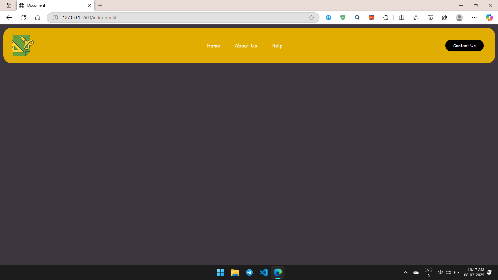

# Simple Navbar  
A basic **navigation bar** built using **HTML & CSS**.  

## 📸 Preview  
  

## 🛠 Technologies Used  
- **HTML** – Structure of the navbar  
- **CSS** – Styling and responsiveness  

## 🚀 How to Use  
1. Clone this repository:  
   ```sh
   git clone https://github.com/your-username/pixel-to-page.git
