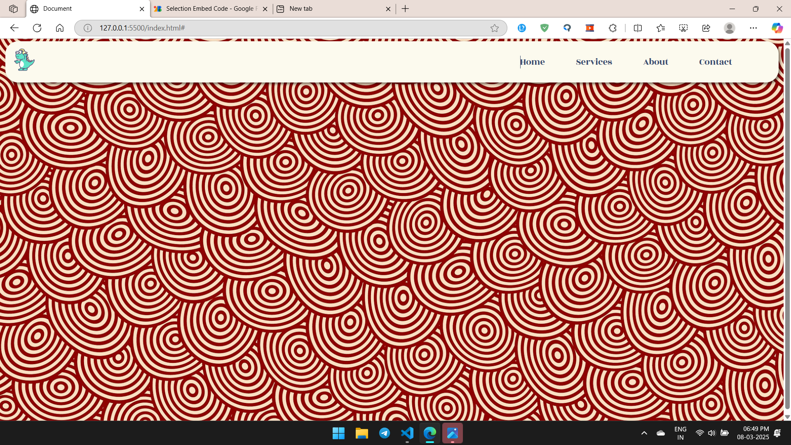

# Responsive Navbar with Sidebar

This project features a **responsive navigation bar** with a sidebar, built using **HTML, CSS, and JavaScript**. It includes smooth transitions and a user-friendly interface.

## Features
- Fully **responsive** navigation bar
- **Sidebar menu** with a close button
- **Hover effects** on navigation links
- **Minimal JavaScript** for functionality

## Video Preview


### Image Preview


## Installation
1. Clone the repository:
   ```bash
   git clone https://github.com/your-username/responsive-navbar.git
